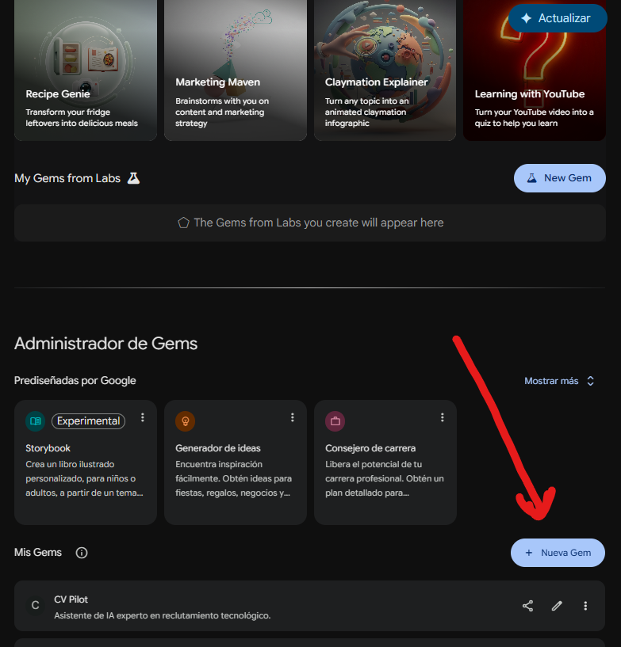
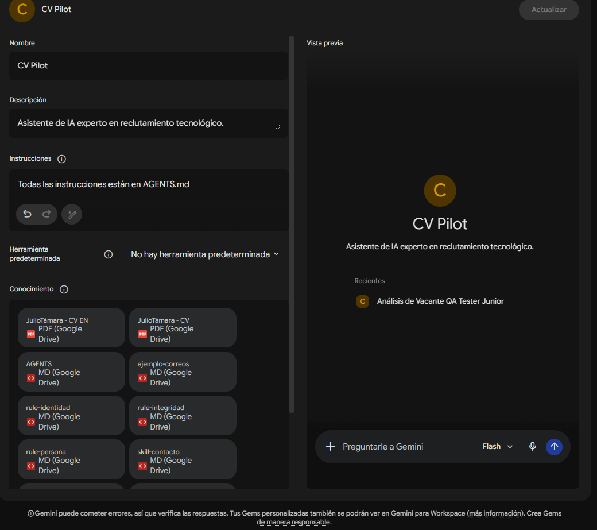

<h1 align="center">📘 Manual de Usuario: CV-Pilot Agent</h1>

**CV-Pilot** es un orquestador inteligente de reclutamiento diseñado para evaluar tu perfil técnico con rigor y gestionar tus postulaciones con estrategia.

## 🚀 Inicio Rápido

## Escoge la modalidad que deseas utilizar:

-  [CV-Pilot Web](#cv-pilot-web)
Esta versión es para uso de IA en la web; tiene una estructura aplanada, es decir, no se divide por carpetas para impedir posibles conflictos de búsqueda de información de parte de cualquier agente que vayas a usar.

**Mi recomendación:** Utiliza esta versión en una gema de Google Gemini. Literalmente puedes usarla de forma infinita sin preocuparte por tokens con una cuenta gratuita.

- [CV-Pilot Agent](#cv-pilot-agent)
Esta versión es para un uso desde cualquier aplicación que soporte agentes custom como OpenCode, Codex, Antigravity, Claude Code/Desktop y cualquier otra incluyendo modelos de IA locales.

---

### CV-Pilot Web

1. **Pre-configuración Inicial:** 

   Descarga o clona el repositorio, extrae todos los archivos ubicados dentro de la carpeta `cv-pilot-web`.

   - **Recomendación:** Abre `user-identidad.md` y `ejemplo-correos.md`, y rellénalos con tus datos personales y correos previos que tengas.
   - Sube todos los archivos (`AGENTS.md`, `ejemplo-correos.md`, `rule-integridad.md`, `user-identidad.md`, `rule-persona.md`, `skill-contacto.md`, `skill-formatos.md` y `skill-redaccion.md`) en la sección de "Conocimiento" de la gema de [Gemini](https://gemini.google.com/gems/view).

   **Imágenes de referencia:**
   1. Al abrir la ventana de Gemas verás la sección de + Nueva Gema:
   
      

   2. Al darle clic se te abrirá el panel en el que deberás configurar la gema colocando el nombre, la descripción y los archivos de conocimiento.

      

   **Nota:** Como se muestra en la imagen, basta con que en instrucciones coloques que debe seguir las descritas en AGENTS.md.

2. **Ejecución:**
   - Puedes subir tu currículum al conocimiento de la gema o al iniciar un chat lo puedes subir.
   - CV-Pilot realizará una **Validación Semántica (VSI)** inmediata. Si el documento no es un CV profesional, el agente te lo indicará.
   - Si no subes nada en `user-identidad.md` y en `ejemplo-correos.md`, el agente será más genérico pero extraerá la información de tu CV.
  
3. **Análisis de Vacantes:**
   - Pega la descripción de cualquier oferta de empleo en el chat.
   - El agente analizará las brechas técnicas contra tu perfil y te entregará un informe detallado con un veredicto (**Apto / No apto**).

---

### CV-Pilot Agent

1. **Pre-configuración Inicial:** 

   Descarga o clona el repositorio, la estructura de carpetas del proyecto deberá quedarte de la siguiente forma:

   ```
   cv-pilot-agent
   ├── rules/ 
   │   ├── persona.md
   │   └── integridad.md
   ├── skills/
   │   ├── contacto.md
   │   ├── redaccion.md
   │   └── formatos.md
   └── resources/
       ├── ejemplo-correos.md
       └── identidad.md 
   ```

2. **Ejecución:**

   - **En un editor de código:**
      - Abre el editor y pasa la referencia de `AGENTS.md`.
      - Sube tus CV al repositorio (puede ser en la carpeta `resources/`). Si el agente no lo detecta, pásale la referencia también por medio del chat. A diferencia de la versión en web que tiene pre-establecido un RAG que permite la interpretación directa de archivo en PDF, aquí te sugiero usar un MCP para convertir tus CV a formato Markdown.
  
   - **En una terminal:**
      - Ejecuta el comando dependiendo del agente de código que uses. Procura tener un MCP para convertir el CV a formato Markdown y alojarlo en la carpeta `resources/`. Si el agente no lo detecta, pasa la referencia por medio del chat.

3. **Análisis de Vacantes:**
   - Pega la descripción de cualquier oferta de empleo en el chat.
   - El agente analizará las brechas técnicas contra tu perfil y te entregará un informe detallado con un veredicto (**Apto / No apto**).

## 🛠️ ¿Cómo interactuar con el agente?

- **Gestión de Postulaciones:** Si la oferta tiene email, el agente te dará un enlace directo (`mailto:`) y el borrador formal. Si es un portal, te entregará una "Carta de presentación" optimizada para copiar y pegar en formularios web.
- **Modo Discusión (Mentor):** Tras cualquier análisis, puedes elegir la opción "Discusión". En este modo, el agente deja de ser un generador de informes y pasa a ser tu mentor senior para asesorarte estratégicamente.

## 🛡️ Reglas de Oro

- **Privacidad Total:** Si buscas privacidad absoluta, puedes montar todo CV-Pilot utilizando LLMs locales (ej. mediante Ollama o LM Studio) para que ningún dato personal salga de tu infraestructura.
- **Fidelidad Técnica:** El agente no suaviza brechas. Si no tienes el stack requerido, el reporte te mostrará el riesgo crítico de forma cruda y sin rodeos.
- **Transparencia:** Toda la evaluación se basa exclusivamente en tu CV y la descripción de la oferta.
- **Información:** Cuanta más información le suministres al agente más preciso será con las evaluaciones, respuestas y correos. Eso sí, ten cuidado de no inyectarle demasiado ruido.

---
*¿Tienes dudas? Simplemente pregunta al agente y él te guiará.*