# Configuración de GWS para CV-Pilot

Esta guía te permite configurar Google Workspace CLI (`gws`) para que CV-Pilot pueda guardar borradores de correo en Gmail.

---

## 🛠️ Requisitos Previos

1. **Node.js 18+** instalado.
2. **gws CLI**:
   ```bash
   npm install -g @googleworkspace/cli
   ```
3. Una cuenta de Google (personal o de empresa) para usar **Google Cloud**.

---

## 🔐 Paso 1: Configuración de Google Cloud (GCP) y GWS

Para que CV-Pilot tenga permiso de crear borradores en tu Gmail, sigue estos pasos en la [Google Cloud Console](https://console.cloud.google.com/):

### 1.1. Crear proyecto de Google Cloud

Crea un proyecto de Google Cloud (sin organización, el nombre puede ser el que prefieras):

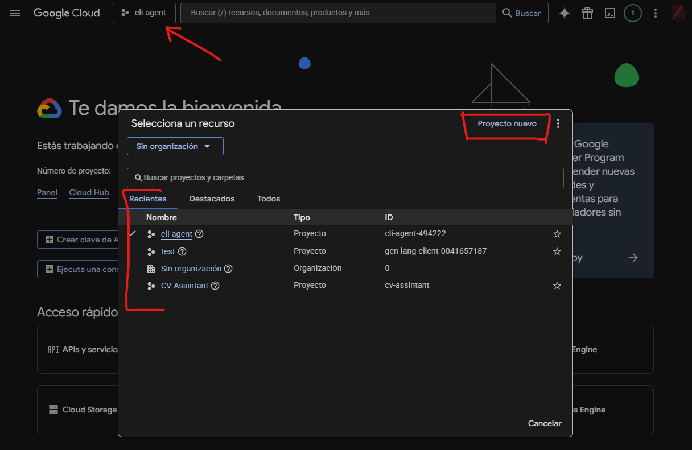
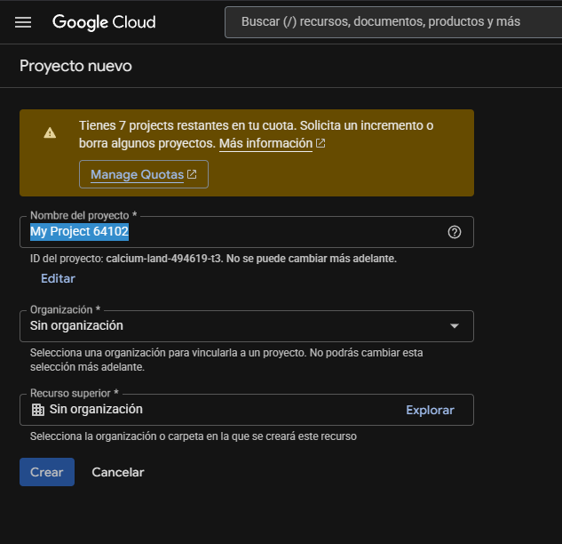

### 1.2. Habilitar Gmail API

En el menú lateral izquierdo de la consola de Google Cloud, selecciona **APIs & Services**.

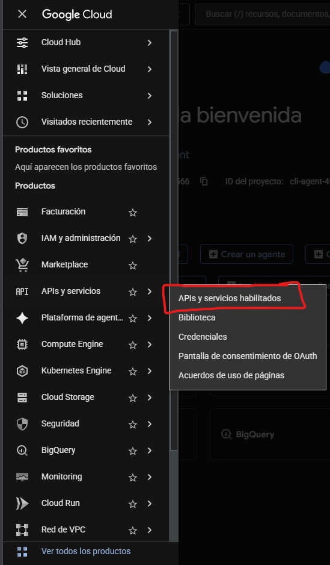

Selecciona el botón **+ Enable APIs and Services**.

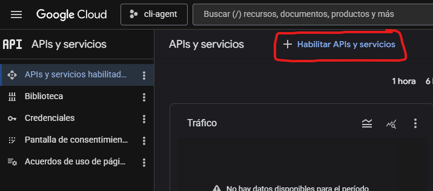

Busca **Gmail API** y habilítala. Si no te aparece, selecciona **Ver todo**.

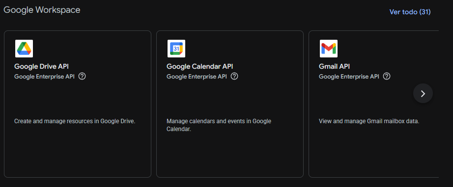

Dentro de la API, haz clic en **Habilitar** y espera a que aparezca **✅ API Habilitada**.

### 1.3. OAuth Consent Screen

Una vez habilitada la API, configura el consentimiento de OAuth. Haz clic en **OAuth consent screen** en el menú lateral izquierdo.

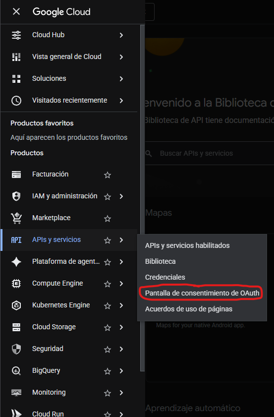

Selecciona **Clients** en el menú lateral izquierdo y luego **+ Create Client**.

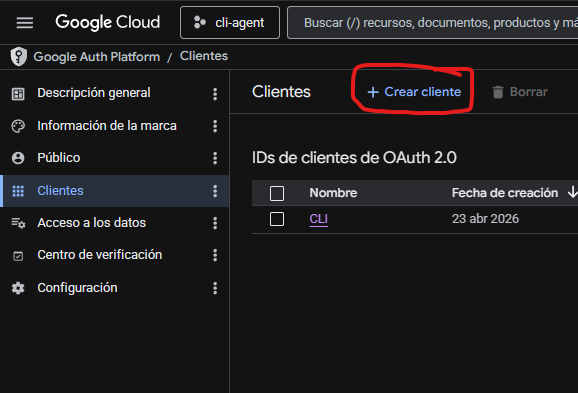

Selecciona **Desktop App** con el nombre que desees y presiona **Create**.

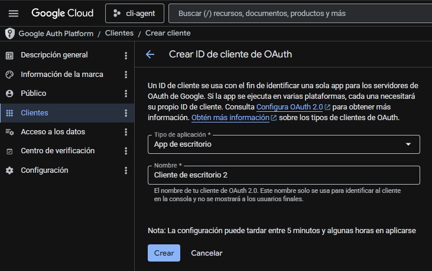

Te aparecerá un menú donde puedes:
1. Copiar el **Client ID** y **Client Secret** (importante para configurar gws).
2. Descargar el JSON con las credenciales. Renómbralo a **client_secret.json** y guárdalo en un lugar seguro → **Esencial para el Paso 2**.

**Recomendación**: descarga el JSON con las credenciales aunque no hagas el Paso 2, así tienes tus credenciales guardadas.

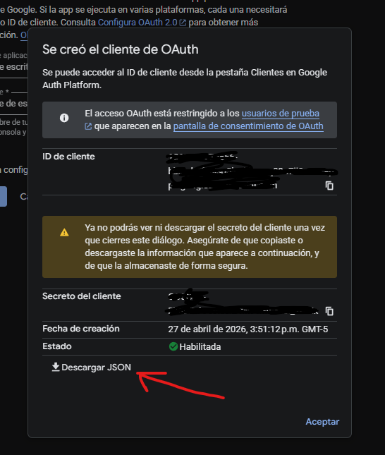

### 1.4. Configuración de gws

1. Con el client ID y client secret listos, ejecuta:

```bash
gws auth setup
```

2. Selecciona tu cuenta de Google:

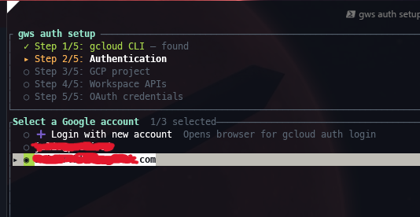

3. Selecciona el proyecto que creaste (mismo nombre e ID del paso [1.1](#11-crear-proyecto-de-google-cloud)):

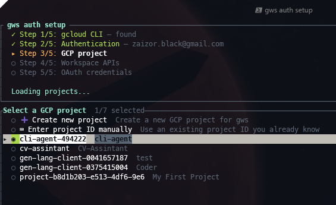

4. Selecciona los servicios de API. Como mínimo necesitas **Gmail**:

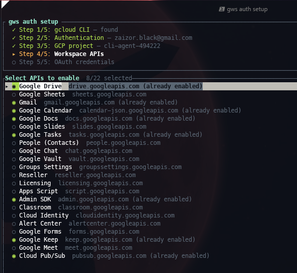

5. Pega el client ID y client secret del paso [1.3](#13-oauth-consent-screen):

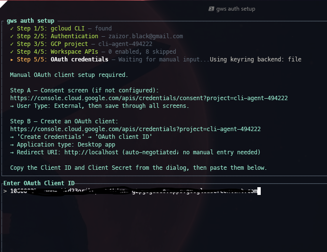
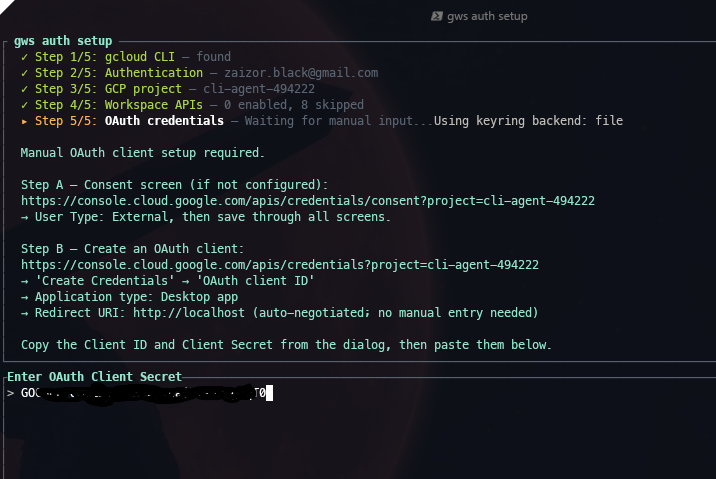

Cuando aparezca `Run gws auth login now? [Y/n]:` escribe `Y` y presiona Enter.

6. Te aparecerá una lista de scopes. Selecciona **Recommended**. Para CV-Pilot, el scope mínimo necesario es `gmail.modify`.

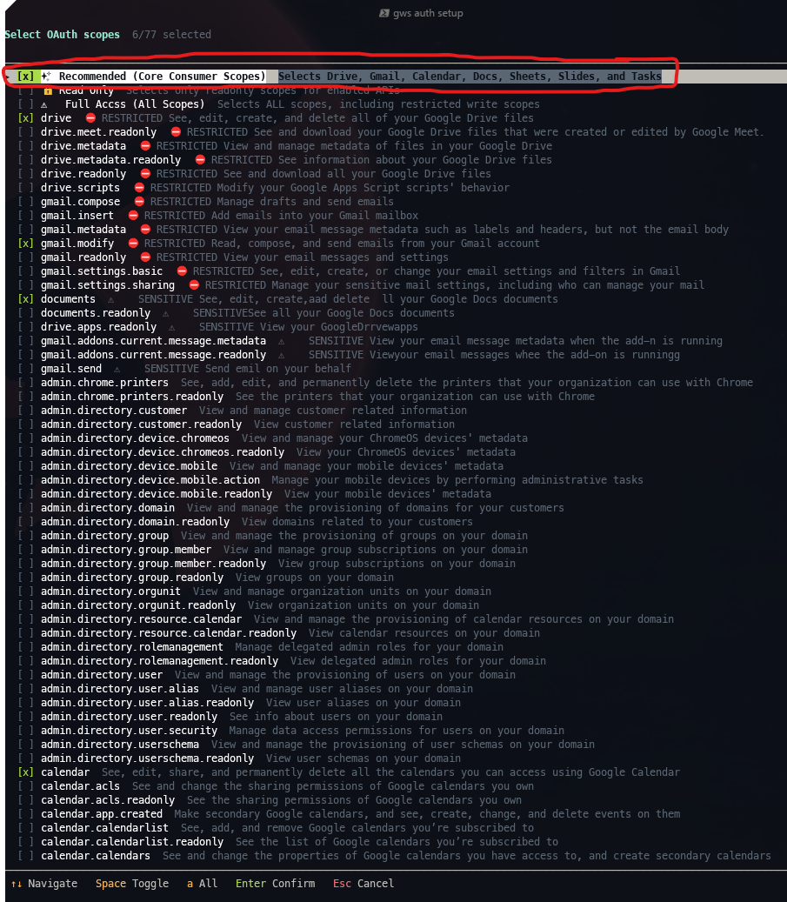

Copia el link que aparece en la consola, ábrelo en el navegador y otorga los permisos a tu cuenta de Google. Al terminar verás:

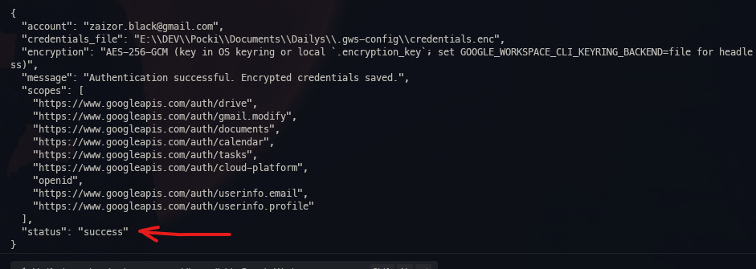

---

#### ⚠️ NOTA IMPORTANTE

El **Paso 2** es opcional. Si quieres que tu sesión de gws permanezca abierta de forma permanente, hazlo. De lo contrario, tendrás que ejecutar `gws auth login` cada vez que enciendas el ordenador y vayas a usar CV-Pilot con Gmail.

---

## ⚙️ Paso 2: Persistencia de Sesión (Recomendado)

Para evitar que Google te pida login cada vez que reinicias el PC:

### 2.1. En Windows, presiona `Win + R`, escribe `sysdm.cpl` y presiona Enter. Selecciona **Advanced** → **Environment Variables**.

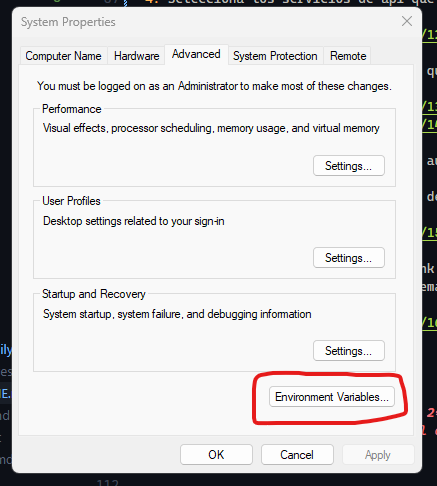

### 2.2. Presiona **New** para crear una nueva variable de entorno.

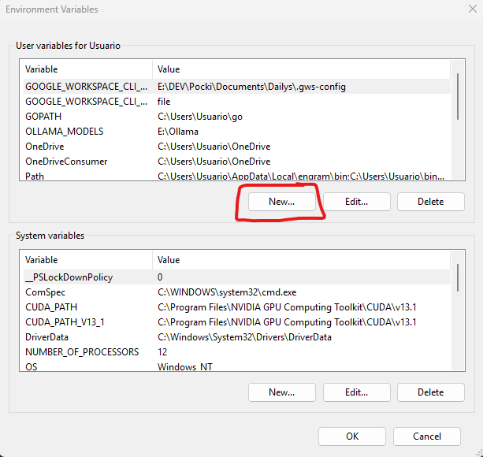

### 2.3. Crea una variable de sistema llamada `GOOGLE_WORKSPACE_CLI_CONFIG_DIR` que apunte a una carpeta permanente con el nombre `.gws-config` (Ej: `C:\Users\TuUsuario\.gws-config`).

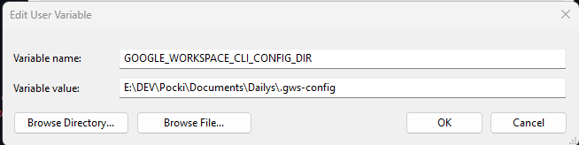

### 2.4. Mueve el archivo `client_secret.json` descargado en el paso [1.3](#13-oauth-consent-screen) dentro de esa carpeta `.gws-config`.

### 2.5. Una vez dentro de la carpeta `.gws-config`, vuelve a ejecutar los pasos de [1.4](#14-configuración-de-gws):

```bash
gws auth login
```

---

## ✅ Verificación

Para comprobar que todo funciona, ejecuta:

```bash
gws auth status
```

Deberías ver `"token_valid": true` y `"gmail.modify"` en los scopes. Si es así, CV-Pilot ya puede guardar borradores en tu Gmail.

---

## ⚠️ Solución de Problemas

### Error 403: Insufficient authentication scopes
- **Causa**: No marcaste los permisos necesarios durante el login.
- **Solución**: Borra el archivo `credentials.enc` en tu carpeta de configuración y repite `gws auth login` seleccionando todos los permisos.

### gws: command not found
- **Causa**: gws no está instalado o no está en el PATH.
- **Solución**: Ejecuta `npm install -g @googleworkspace/cli` y reinicia la terminal.

---

## 🔗 Referencias
- [Google Workspace CLI (gws)](https://github.com/googleworkspace/cli)
- [Gmail API](https://developers.google.com/workspace/gmail/api)
- [CV-Pilot Agent](https://github.com/Juliotamara23/CV-Pilot-Agent)
